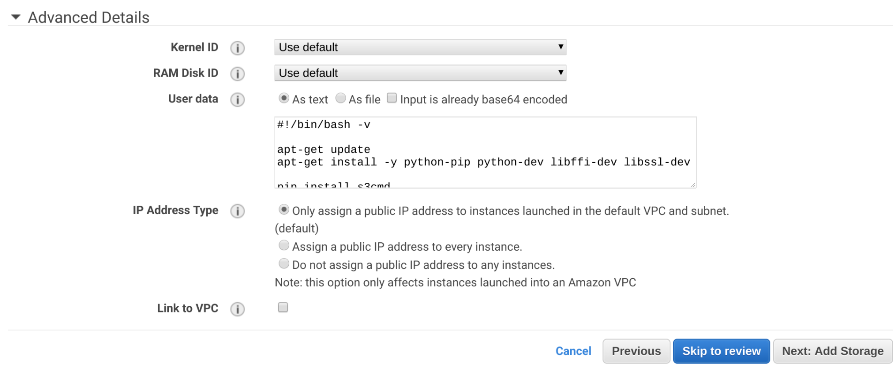
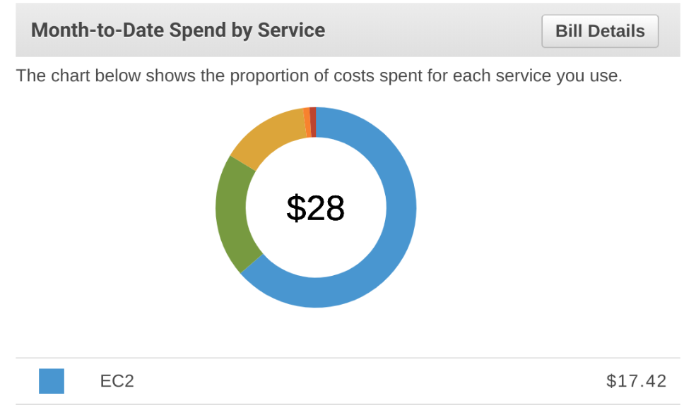
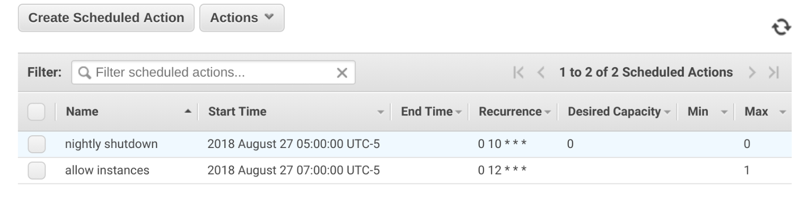

I recently bought a <a href="https://store.google.com/us/product/google_pixelbook">Pixelbook</a>, 
which is great for lots of things, but not coding. I knew this at purchase time, however, 
so I just planned on SSH’ing wherever I wanted to work.

Most of my home projects live on a personal EC2 instance I’ve set up.
It lives in an autoscale group whose size is usually 0, so I’m not paying for
the machine when I’m not using it.

One nit with this setup, however, was that I had to sign into the AWS console to turn on the machine, so
I took my no-longer-used IoT button (<a href="http://terrbear.org/scala/iot/ios/lazy/2016/05/23/amazon-iot-button.html">see here</a>) 
and plumbed it such that it behaves like a power button for my EC2 instance.

I’ve set all of this up at a <a href="https://github.com/terrbear/boxomatic">GitHub repo</a> so you can copy it and do the same.

First, the high level workflow:

1. Push IoT Button
1. Trigger <a href="https://aws.amazon.com/lambda/">Lambda</a>
1. Set ASG desired size to (ASG size == 0 ? 1 : 0)
1. Bootstrap from <a href="https://www.ansible.com/">Ansible</a>

## AWS Setup

> Note: You can achieve something similar with a single EC2 instance and suspend
> it between uses. That said, I’m suspicious of any EC2 host that’s been running
> around for more than a month, so I prefer having a brand new host each time.

The first step to getting this working is to pick an EC2 instance in a launch
config and create an autoscale group around it. This setup expects an <a href="https://www.ubuntu.com/">Ubuntu</a>
instance. If you go with something else, you’ll need to tweak a lot more to
fit your needs.

The instance will need permissions to access an S3 bucket where you’re keeping
the Ansible config (explained below).

I’m not going to go into VPC setup here, but you want to use a VPC subnet that
has public internet access, and be sure to grant the instance a public IP. If
you don’t do that, you’ll be unable to access your instance directly.

Here’s the first part where things get fun, the user data for the launch config
(available under Advanced Details):

```bash
#!/bin/bash -xev

apt-get update
apt-get install -y python-pip python-dev libffi-dev libssl-dev

pip install s3cmd
pip install markupsafe

mkdir /root/ansible

s3cmd get --recursive s3://YOUR-BUCKET /root/ansible
pip install ansible
pip install setuptools --upgrade

sleep 30

cd /root/ansible && rm ansible.cfg && ansible-galaxy install -r deps.txt > /bootstrap.out

sleep 10

cd /root/ansible && ansible-playbook -i production -c local box.yml >> /bootstrap.out
```

The user data is responsible for installing the bare minimum and grabbing things
from S3. There are some seemingly arbitrary sleeps in there because occasionally
I’ve had the s3cmd still finishing up but Ansible starts running anyway - ¯\\_(ツ)_/¯



Don’t attach any extra storage to the instance at this point - the default
ephemeral storage works fine for what we’re doing.

You’ll want to allow TCP access over port 22 to your IP. If you don’t care,
you can use 0.0.0.0/0 for your source, though I’d suggest just doing a quick
`curl ifconfig.co` and using that instead.

Go create an autoscale group using the launch config you just created, and
keep it isolated to a single availability zone. It doesn’t matter which, 
but needs to be just one.

Then, create an EBS volume in the same availability zone as your autoscale group.
This will be where your home directory and your code will live. Keep in mind that
you will pay for EBS capacity even if you’re not using it.

Lastly, you’ll want to create an AWS account with API access that can:

1. Create Route53 records in whatever zone you want your DNS entry to be
1. Attach EBS volumes to EC2 instances

## Bootstrapping With Ansible

In an effort to be cheap/simple, I’ve avoided better tools like <a href="https://aws.amazon.com/opsworks/">OpsWorks</a>
 or <a href="https://www.ansible.com/products/tower">Ansible Tower</a> and gone with simply
hosting Ansible in S3.

The host boots up, pulls from S3 all the ansible provisioning info, runs it,
and then I can SSH in happily.

I have more things that happen in my own repository, but the basic necessities are:

1. vim
1. set a Route53 entry so I don’t have to find the IP
1. attach and mount an EBS volume so my workspace persists
1. install a few things that I figure everyone wants

You’ll need to walk through the git repo and replace a few things for this to
work for you (eg, your AWS keys will need to be in the playbook). This is described
in the <a href="https://github.com/terrbear/boxomatic/blob/master/README.markdown">README</a> in the git repo.

<em>Be sure to publish your Ansible files before proceeding!</em>

The EC2 instance needs to be able to pull the Ansible data from S3, and then
Ansible needs to be able to create records in Route53 and attach EBS volumes.

I didn’t figure out how to get the AWS Ansible calls to rely just on the native
IAM role, so I have a separate account with AWS API credentials that can handle
the EBS and Route53 tasks (described above).

> Note: There’s a Vagrantfile in the ansible/ directory in the git repo that
> allows for faster testing of Ansible changes than waiting on AWS to boot
> an instance each time.

Once your host is up, you can verify it worked by checking out `/bootstrap.out`, eg:

    - downloading role 'nodejs', owned by geerlingguy
    - downloading role from https://github.com/geerlingguy/ansible-role-nodejs/archive/4.2.0.tar.gz
    - extracting geerlingguy.nodejs to /root/.ansible/roles/geerlingguy.nodejs
    - geerlingguy.nodejs (4.2.0) was installed successfully

    PLAY [box] ***************************************************************

    TASK [Gathering Facts] *********************************************************
    ok: [127.0.0.1]

    TASK [common : apt get update] *************************************************
    changed: [127.0.0.1]

    TASK [common : install useful stuff] *******************************************
    changed: [127.0.0.1] => (item=[u'ntp', u'vim', u'openjdk-8-jdk-headless', u'ruby', u'ruby-dev', u'ruby-all-dev', u'ruby-bundler', u'postgresql', u'libpq-dev', u'pkg-config', u'ruby-pkg-config', u'libmagickwand-dev', u'imagemagick', u'libssl-dev', u'libffi-dev', u'dstat', u'htop', u'direnv', u'python-psycopg2', u'awscli', u'jq'])

    TASK [aws : boto] **************************************************************
    changed: [127.0.0.1]

    TASK [ebs : who am i] **********************************************************
    ok: [127.0.0.1]

    TASK [ebs : ebs vol] ***********************************************************
    changed: [127.0.0.1]

    TASK [ebs : name me] ***********************************************************
    changed: [127.0.0.1]

    <snip>

    PLAY RECAP *********************************************************************
    127.0.0.1                  : ok=23   changed=18   unreachable=0    failed=0   

## Boxomatic: The Lambda

This gets triggered when the button is pushed and is responsible for adjusting the autoscale
group size. The code itself is pretty short:

```js
const AWS = require("aws-sdk");
const Promise = require("bluebird");
const autoscaling = new AWS.AutoScaling();

const ASG_NAME = process.env.ASG_NAME;

function checkCapacity() {
  const params = {
    AutoScalingGroupNames: [ASG_NAME],
  };

  return autoscaling.describeAutoScalingGroups(params).promise()
    .then((data) => {
      console.log("data back: ", data);
      const asg = data.AutoScalingGroups[0];
      return asg.Instances.length + asg.DesiredCapacity;
    });
}

function handler(event, context, callback) {
  const params = {
    AutoScalingGroupName: ASG_NAME, 
    DesiredCapacity: 1, 
    HonorCooldown: true
  };

  checkCapacity().then((size) => {
    if (size > 0) {
      params.DesiredCapacity = 0;
    }

    autoscaling.setDesiredCapacity(params, function(err, data) {
      if (err) {
        console.log(err, err.stack); 
        callback(err, err);
      } else {
        callback(null, "gotime");
      }
    });
  });
}

exports.handler = handler;
```

> Note: When creating this Lambda in your account, it’s easiest to 
> create a lambda named ‘boxomatic’ that is javascript and blank, and then
> run the deploy.sh script. Otherwise, just npm i and zip it and upload it.

You’ll need to give the lambda permission to read and modify autoscaling groups. 
I just used the stock `arn:aws:iam::aws:policy/AutoScalingFullAccess` policy.

When creating the Lambda, be sure to set the environment variable `ASG_NAME` to
whatever you named your autoscale group.

Now push the button and watch everything come to life!

## Cost

Even when I get ambitious and turn on the machine on days I don’t use it, my costs
have yet to exceed $40 in a month. I use this mostly on weekends. Here’s my bill
for August as of 28Aug08:



## Safety Measures

I have two scheduled actions for my autoscale group that prevent me from
accidentally paying for a month’s worth of instance time. At midnight(ish) every
night, the autoscale group sets desired and max capacity to 0, which shuts down
the host if it’s running.

Shortly after, I set the max capacity back to 1, so the next time I push the button,
the host comes on (if you set desired > max, AWS errors).



## Troubleshooting

If you’re first trying to get this running and nothing seems to happen when you push
the button, first trigger the lambda manually (the hello world payload is fine) and watch
the <a href="https://aws.amazon.com/cloudwatch/">Cloudwatch</a> logs associated with that run. 
If that all looks good, go manually increase the desired capacity of your autoscale group 
and see what happens there.

Ansible’s fun 
<a href="https://docs.ansible.com/ansible/devel/porting_guides/porting_guide_2.4.html#deprecated">habit</a> 
<a href="https://docs.ansible.com/ansible/devel/porting_guides/porting_guide_2.5.html#deprecated">of</a> 
<a href="https://docs.ansible.com/ansible/devel/porting_guides/porting_guide_2.7.html#deprecated">deprecating</a> 
<a href="https://docs.ansible.com/ansible/devel/porting_guides/porting_guide_2.6.html#deprecated">commands</a> 
means if you wait 2 years between pressing your button, you’ll have some commands that fail. 
When that happens, you can still access the host, you’ll just have to sign into the AWS console 
to get the public IP and SSH directly to that instead of whatever DNS you picked.

Check `/bootstrap.out` and `/var/log/cloud-init-output.log` for clues.

