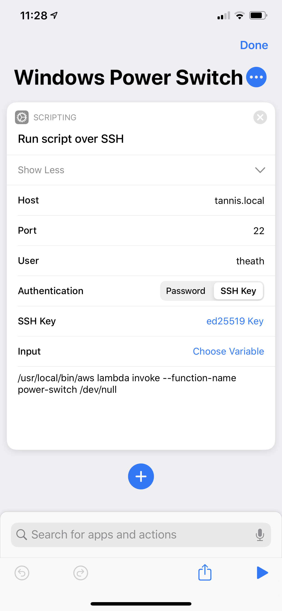

A few years back, I used a setup like this for my own [remote-development host in AWS](https://terrbear.org/iot-power-button/). 
It worked most of the time, but I didn't pin Ansible versions and would have to 
troubleshoot why things didn't bootstrap correctly every few weeks, and eventually 
settled on tunneling into my Macbook.

Around that time, my wife's EEEPC became unusably slow. She uses it for embroidery 
software, which seems to be updated every 13 years. 

Not wanting to buy a new computer for 2 hours of use per month, I set up a t2.large 
(now a t3.large) up on AWS and switched the IoT button to switch it on/off. This 
stack ends up costing about less than $10/month (the EIP is the bulk of the cost), 
takes up no space in the house, and requires about zero maintenance. Here's how to do it.

## Overview

> <i class="fa fa-github"></i> All the resources for this post can be found on [GitHub](https://github.com/terrbear/terrbear.github.io/tree/develop/content/blog/on-demand-windows-machine/resources).

To keep the host easily accessible after setup, we're going to use an Elastic IP.
You can save your connection information in your RDP client and won't have to jump
into the AWS console to find the IP.

The security group is only going to allow access to your WAN IP. My wife's computer 
has a cronjob that updates the stack periodically with our home IP. The cronjob looks 
like this:

```cron
0 * * * * /usr/local/bin/aws cloudformation deploy --stack-name windows-box --template-file ~user/cloudformation/cf-auto-windows-box.yml --parameter-overrides "ClientIP=$(curl ifconfig.co)" --no-fail-on-empty-changeset
```

You'll have to know enough to pick the right VPC and subnet for your account (it needs internet access).

Using this CloudFormation template TODO LINK TO IT, you can create the stack through the AWS console or just command-line it:

> <i class="fas fa-lightbulb"></i> [ifconfig.co](https://ifconfig.co) is a great resource for grabbing your WAN IP

```shell
aws cloudformation deploy \
  --stack-name windows-box \
  --template-file cf-auto-windows-box.yml \
  --capabilities CAPABILITY_NAMED_IAM \
  --parameter-overrides \
    "KeyPair=YOUR-KEY-NAME" \
    "VPC=YOUR-VPC-ID" \
    "Subnet=YOUR-SUBNET-ID" \
    "ClientIP=$(curl ifconfig.co)"
```

## Lambda

The template adds two lambdas to your account, `power-switch` and `power-off`. 

The switch lambda toggles the state from stopped to running:

```js
const AWS = require("aws-sdk");

const instanceId = process.env.INSTANCE_ID;

const ec2 = new AWS.EC2();

const checkIfRunning = async () => {
  const response = await ec2
    .describeInstances({ InstanceIds: [instanceId] })
    .promise();
  return response.Reservations[0].Instances[0].State.Name !== "stopped";
};

exports.handler = async () => {
  const params = {
    InstanceIds: [instanceId]
  };

  const running = await checkIfRunning();

  if (running) {
    return ec2.stopInstances(params).promise();
  }

  return ec2.startInstances(params).promise();
};
```

The `power-off` lambda on the other hand always turns the machine off:

```js
const AWS = require("aws-sdk");

const instanceId = process.env.INSTANCE_ID;

const ec2 = new AWS.EC2();

exports.handler = () => {
  const params = {
    InstanceIds: [instanceId]
  };
  return ec2.stopInstances(params).promise();
};
```

The lambdas will only be allowed to describe your EC2 instances and turn on/off the instance created as part of the stack.

## Flipping the switch

<p class="flex">
  Thanks to iOS's Shortcuts allowing SSH commands, you can actually make a nifty power switch from your phone:

  
</p>

As an added bonus for the iOS power switch, you could issue the CloudFormation update to allow your current
IP to connect, instead of relying on a cronjob. IoT button generated events do not provide IP information,
so if you like the button approach, you're stuck with a cronjob or one-off updates or procuring a static IP.

You can also add your IoT button as a trigger in the Lambda console.

If neither of those are appealing, you can always just command line:

```shell
aws lambda invoke --function-name power-switch /dev/null
```

## Cost Control

The reason for the `power-off` lambda is to ensure the host doesn't stay on accidentally. The stack
will schedule it to turn off the host (or try to, at least), once per day. You'll want to change
the cron expression to match your timezone (in Pacific/Auckland I've got it set to 1am-ish).

```yml{6}
PowerOffNightlyRule:
  Type: AWS::Events::Rule
  Properties:
    Name: power-off-nightly
    Description: powers off the instance daily
    ScheduleExpression: cron(0 13 * * ? *)
    State: ENABLED
    Targets:
      - Arn: !GetAtt PowerOff.Arn
        Id: PowerOffNightly
```