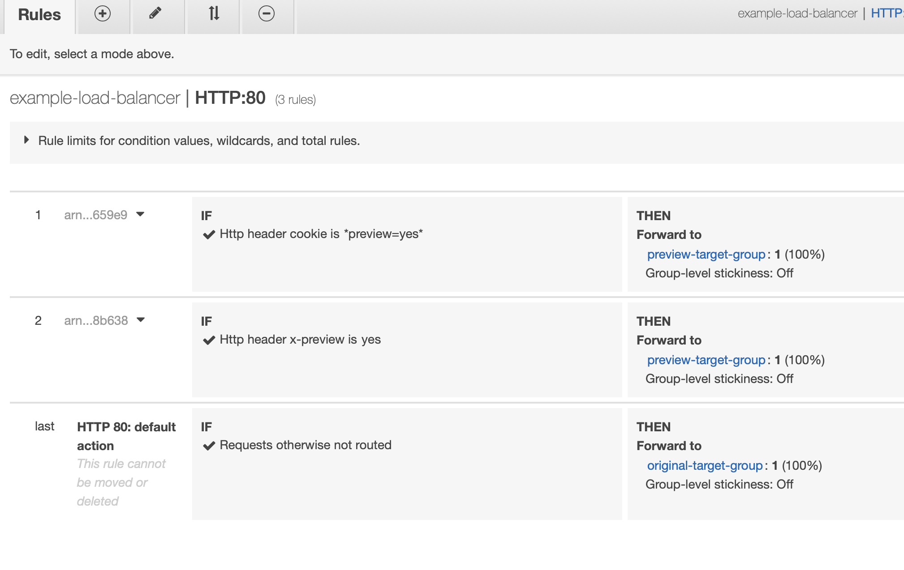
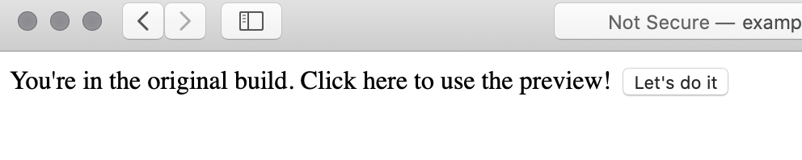
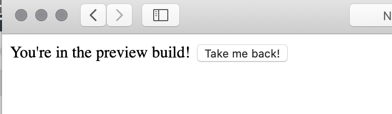

AWS's [application load balancers](https://docs.aws.amazon.com/elasticloadbalancing/latest/application/introduction.html) 
support routing traffic to different locations based on 
[HTTP request characteristics](https://docs.aws.amazon.com/elasticloadbalancing/latest/application/listener-update-rules.html). 
This is helpful if you want to allow users to opt-in to use a new service.

Typically I've used feature flags to determine if a user should see new features, but
feature flags are hard to manage when the feature affects a huge surface area. In this case,
it can be easier to host an old and new version of the service side-by-side. You can gently bring 
users into your new features and easily fall back to the old app if something is missing.

To let users opt-in, let's build a workflow like this:

1. User goes to mysite.com, sees original service.
1. Original site shows a button that lets them opt-in to the new service.
1. When they click the button, a cookie is written. We'll set it as `preview=yes`.
1. Then the browser refreshes (`window.location.reload()`), re-requesting mysite.com. The ALB sees the preview cookie, and directs traffic to the new service.
1. We'll support opt-out by allowing the new service to delete the cookie.

## Step 1: Make an old service that allows opt-in

> <i class="fa fa-github"></i> All the resources for this post can be found on [GitHub](https://github.com/terrbear/terrbear.github.io/tree/develop/content/blog/opt-in-previews-with-albs).

I've made what I think is the simplest proof of concept here:

```html
<html>
  <script type="text/javascript">
    const preview = () => {
      const expires = new Date();
      expires.setMonth(expires.getMonth() + 1 % 12);
      document.cookie = `preview=yes; expires=${expires.toUTCString()}; path=/`;

      window.location.reload();
    };
  </script>

  <body>
    You're in the original build. Click here to use the preview! 
    <button onClick="preview()">Let's do it</button>
  </body>
</html>
```

Again, the idea is to let the user write a preview cookie and get a different app. This will
set a cookie that'll expire in a month, at which point the user will get sent back to the original service.

## Step 2: Make a preview service that allows opts-out

Our super-advanced preview service that'll only show up for users who want to opt in:

```html
<html>
  <script type="text/javascript">
    const unpreview = () => {
      document.cookie = "preview=; expires=Thu, 01 Jan 1970 00:00:00 GMT; path=/";
      window.location.reload();
    };
  </script>

  <body>
    You're in the preview build! <button onClick="unpreview()">Take me back!</button>
  </body>
</html>
```

The button just deletes the cookie and reloads the page.

## Step 3: Create the stack

> <i class="fab fa-docker"></i> The Docker containers are built using [this Dockerfile](https://github.com/terrbear/terrbear.github.io/blob/develop/content/blog/opt-in-previews-with-albs/Dockerfile)

This is the CloudFormation snippet that will create the ALB rules.

Note that the cookie handling uses wildcards to allow for other cookie values in there.

I've also added an `x-preview` header to make API interactions easier. Note that the "yes"
for the header value is in quotes because YAML is "helpful."

```yml
PreviewCookieRule:
  Type: AWS::ElasticLoadBalancingV2::ListenerRule
  Properties: 
    Actions: 
      - Type: forward
        TargetGroupArn: !Ref PreviewTargetGroup
    Conditions: 
      - Field: http-header
        HttpHeaderConfig:
          HttpHeaderName: cookie
          Values:
            - "*preview=yes*"
    ListenerArn: !Ref HTTPListener
    Priority: 3

PreviewHeaderRule:
  Type: AWS::ElasticLoadBalancingV2::ListenerRule
  Properties: 
    Actions: 
      - Type: forward
        TargetGroupArn: !Ref PreviewTargetGroup
    Conditions: 
      - Field: http-header
        HttpHeaderConfig:
          HttpHeaderName: x-preview
          Values:
            - "yes"
    ListenerArn: !Ref HTTPListener
    Priority: 4
```

Essentially the load balancer is set up to forward traffic to OriginalTargetGroup, but then
we add these rules to tell it that, if either of our rules match, forward to PreviewTargetGroup instead.

Assuming you have a VPC set up with a couple public subnets and an ECS cluster, you can run something like
this:

```shell
aws cloudformation create-stack \
  --stack-name example \
  --template-body "$(cat cf-preview.yml)" \
  --capabilities CAPABILITY_NAMED_IAM \
  --parameters ParameterKey=VPC,ParameterValue=$VPCID \
  ParameterKey=Subnet1,ParameterValue=$Subnet1ID \
  ParameterKey=Subnet2,ParameterValue=$Subnet2ID \
  ParameterKey=Cluster,ParameterValue=$ECSClusterName
```

If not, you'll have to go by my screenshots.

In AWS, after, the stack is created, you'll be able to see how the ALB rules dictate traffic flow:

> <i class="fas fa-exclamation-triangle"></i> If you use a header like this for XHR requests coming from a different origin, remember to update your allowed CORS headers or your requests will be quietly routed to the old service.



## Seeing it in action

Here's the original site:



```shell
~❯ curl http://example-load-balancer-55775428.us-east-1.elb.amazonaws.com
<html>
  <script type="text/javascript">
    const preview = () => {
      const expires = new Date();
      expires.setMonth(expires.getMonth() + 1 % 12);
      document.cookie = `preview=yes; expires=${expires.toUTCString()}; path=/`;

      window.location.reload();
    };
  </script>

  <body>
    You're in the original build. Click here to use the preview! <button onClick="preview()">Let's do it</button>
  </body>
</html>
```

And here's our fancy preview version:



```shell
~❯ curl -H "x-preview: yes" http://example-load-balancer-55775428.us-east-1.elb.amazonaws.com
<html>
  <script type="text/javascript">
    const unpreview = () => {
      document.cookie = "preview=; expires=Thu, 01 Jan 1970 00:00:00 GMT; path=/";
      window.location.reload();
    };
  </script>

  <body>
    You're in the preview build! <button onClick="unpreview()">Take me back!</button>
  </body>
</html>
```

You can go back and forth ad nauseum. 

## Finishing up

> <i class="fas fa-check-circle"></i> Be sure to delete your CloudFormation stack when you're done

You can update the containers independently through CloudFormation, so you could continually make 
improvements to your preview version while the original stays in its well-known state.

Once happy with the preview version, you'd want to update the original service to use the new
container version, and remove the ALB rules. The preview cookie wouldn't cause any problems, For
more real-world usage, I'd suggest using something other than "yes" (like the new version name),
to prevent cookie hoarders from accidentally opting in to something they didn't mean to.